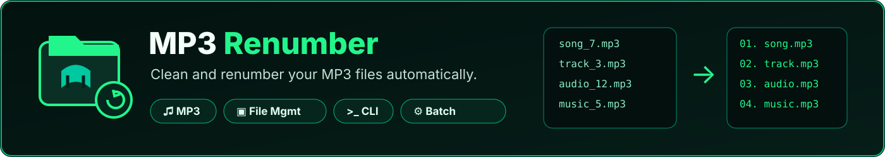

<p align="center">
  
</p>

<p align="center">
  <a href="LICENSE"></a>
  
  
  
</p>

# MP3 Renumber

A small, dependency-free command-line tool that **cleans and renumbers MP3 file names** in a folder. It strips any old numbering, sorts the files in natural order, and adds a fresh sequential prefix starting from any number you choose, with any padding width you choose. Every change is shown in a **preview** before anything is renamed.

```
03 - My Song.mp3   →   007 - My Song.mp3
My Song 12.mp3     →   008 - My Song.mp3
```

Ideal for lecture series, audiobooks, podcasts, and any collection where file order matters (for example, playing in the right order on a phone or car stereo).

---

##  Table of contents

- [Why this tool](#why-this-tool)
- [Features](#features)
- [Requirements](#requirements)
- [Installation](#installation)
- [Usage](#usage)
- [How it works](#how-it-works)
- [Honest limitations](#honest-limitations)
- [Troubleshooting](#troubleshooting)
- [Contributing](#contributing)
- [License](#license)

---

##  Why this tool

Downloaded audio series rarely have clean, consistent file names. Numbers show up at the start, in the middle, wrapped in brackets, or not at all — and players sort inconsistently as a result. Renaming a large folder by hand is slow and error-prone.

This tool automates that cleanup in one pass: strip whatever numbering exists, re-sort the files the way a person actually reads them (natural order, not plain alphabetical), and apply a single, consistent numbering scheme — while always showing a full preview first, since renaming a folder is not something you want to get wrong.

---

##  Features

- **Preview before renaming** – see every old → new name first, and nothing is touched until you confirm with `y`.
- **Natural sorting** – files are ordered the way a human expects (`2` comes before `10`), not alphabetically.
- **Cleans old numbering anywhere in the name** – not only at the start. Numbers such as `03`, `(3)`, `[3]`, `#3` are removed wherever they appear.
- **Safe with words containing digits** – `MP3`, `4K`, `2Pac` are left untouched, because the digits are attached to letters and are not standalone numbers.
- **Custom start number** – begin at `1`, `101`, or any non-negative number.
- **Custom zero-padding** – `01`, `001`, `0001`, and so on.
- **Collision-safe renaming** – files are moved to temporary names first, so overlapping names never overwrite each other.
- **Unicode friendly** – works with Arabic and other non-Latin file names.
- **Zero dependencies** – uses only the Python standard library.
- **Cross-platform** – Windows, macOS, Linux, and Android (Termux).

---

##  Requirements

- Python **3.6** or newer

No other packages are needed.

**Termux (Android)**
```bash
pkg update
pkg install python
```

---

##  Installation

```bash
git clone https://github.com/eldqyqy2007/mp3-renumber.git
cd mp3-renumber
```

Or simply download `mp3_renumber.py` and run it directly.

---

##  Usage

```bash
python3 mp3_renumber.py
```

The tool asks three questions, shows a preview, and then asks for confirmation:

| Prompt | Meaning | Example |
|---|---|---|
| Folder path | Folder that contains the MP3 files | `/sdcard/Music/course` |
| Start number | First number to use | `1` |
| Number of digits | Padding width | `3` → `001` |

On Termux, the shared storage is available under `~/storage/shared/` after running `termux-setup-storage` once.

###  Example session

```text
=== MP3 Renumber Tool ===

Enter the folder path containing the MP3 files: /sdcard/Music/course
Enter the number you want to start counting from: 1
How many digits should the numbers have? (e.g. 2 -> 01, 3 -> 001, 4 -> 0001): 3

Found 3 MP3 file(s). Starting from number 1.

Preview of the changes (nothing has been renamed yet):

  Lecture 1.mp3   ->  001 - Lecture.mp3
  Lecture 2.mp3   ->  002 - Lecture.mp3
  Lecture 10.mp3  ->  003 - Lecture.mp3

Rename these 3 file(s)? (y/n): y

  Lecture 1.mp3   ->  001 - Lecture.mp3
  Lecture 2.mp3   ->  002 - Lecture.mp3
  Lecture 10.mp3  ->  003 - Lecture.mp3

Done! Renamed 3 file(s) starting from 1.
```

Answer `n` at the confirmation prompt to cancel; no file is changed.

---

##  How it works

1. **Scan** – collects all files ending in `.mp3` (case-insensitive) in the chosen folder. Sub-folders are not searched.
2. **Sort** – orders them with a natural sort, splitting each name into text and number parts.
3. **Clean** – removes every standalone number (optionally wrapped in `()`, `[]`, or preceded by `#`) and tidies leftover separators (`-`, `_`, `.`, `:`, extra spaces).
4. **Number** – builds each new name as `<padded number> - <clean name>.mp3`.
5. **Preview & confirm** – prints the complete list of old and new names and waits for `y` or `n`. Nothing has been changed at this point.
6. **Rename safely** – after confirmation, renames every file to a temporary `.tmp_renaming` name first, then to its final name, so no file is ever overwritten.

###  What counts as "old numbering"?

| Original name | Cleaned name | Why |
|---|---|---|
| `03 - My Song` | `My Song` | Leading number |
| `My Song 12` | `My Song` | Trailing number |
| `[7] Name #3` | `Name` | Bracketed and `#` numbers |
| `Song 2Pac` | `Song 2Pac` | Digit attached to letters – kept |
| `Intro MP3` | `Intro MP3` | Digit attached to letters – kept |
| `Track_05` | `Track_05` | Underscore joins the number to the word – kept |

---

##  Honest limitations

- **Every standalone number is removed, not just the leading one.** A name like `Lecture 5 - Part 2` becomes `Lecture Part`. The preview lets you catch this before confirming — cancel with `n` if your titles contain numbers you want to keep (years, episode numbers, and so on).
- **Separators inside a name may be merged.** Removing a number from the middle of a name can also drop the dash next to it (`Cool - Track 05` → `Cool Track`).
- **A name made only of numbers** (for example `2024.mp3`) becomes `001 - .mp3`, because nothing remains after cleaning.
- **No undo after confirmation.** The preview is the safety net; once you type `y`, renaming happens immediately and there is no automatic rollback. Consider trying the tool on a **copy** of your folder the first time.
- **Padding does not auto-expand.** If the last number needs more digits than your chosen padding (for example 1000 files with padding 3), the tool prints a note and does not pad further.
- **Only `.mp3` files are touched.** All other files in the folder are left alone.
- **No automated test suite.** Behavior has been checked manually against a range of file-name patterns, not with CI or unit tests.

---

##  Troubleshooting

**"This path does not exist or is not a folder"**
Check the path for typos. On Termux, run `termux-setup-storage` first and use a path under `~/storage/shared/`.

**"No MP3 files were found in this folder"**
The tool only looks inside the folder you gave it, not its sub-folders, and only for files ending in `.mp3`.

**Some files end with `.tmp_renaming`**
The run was interrupted mid-rename. Remove the `.tmp_renaming` suffix from those file names and run the tool again.

---

##  Contributing

Issues and pull requests are welcome. Ideas for future improvements:

- Undo log (restore original names after a run)
- Support for more audio formats
- Optional recursive folder scanning

---

##  License

This project is licensed under the [MIT License](LICENSE).
